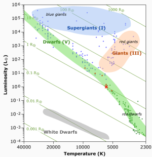

## Main Sequence 
## Stellar Explorer


## ShinyApp Pitch

--- &twocol

## The Main Sequence

***  =left

> * 90% of observed stars lie on the Main Sequence. Stars spend most of their life here before evolving off the sequence. It corresponds to the period when stars burn hydrogen to helium in their cores.

> * Once a significant amount of hydrogen in the core has been consumed, stars then begin to evolve into more luminous stars.

*** =right


--- &twocol

## The Main Sequence

***  =left

> * When stars lie on the main sequence, we can estimate their mass (M), radius (R) and luminosity (L, energy emitted) from their surface temperature. 

> * This is not so easily done once the stars begin to evolve.

*** =right


---

### ShinyApp: The Main Sequence Explorer

<a href="https://devnathb.shinyapps.io/Main_Sequence_Stellar_Explorer">Link to ShinyApp: The Main Sequence Explorer</a>

> * The app enables the user to explore the main sequence, by selecting a stellar temperature. 

> * The position of the star is displayed on the main sequence.

> * The app does this by fitting a model to the stellar data set and predicting the value of L given the user's input temperature

> * The star's mass and radius are calculated in solar units, and the results are displayed below the plot.

> * This allows the user to explore the relationship between a star's temperature, mass, radius and luminosity (energy emitted by the star). 


---

### ShinyApp: Example calculations

> * Luminosity and Radius can be related to the temperature T$_{\rm eff}$ by the Stefan–Boltzmann law: $L = 4\pi\sigma R^{2}T_{\rm eff}^4$ 

> * Mass & Radius are related by: $R = M^{0.738}$ 

```{r}
#The Sun, note: all units are solar, i.e. 1 = 1 solar radii, or 1 solar mass
teff <- 5779.6
lum <- 1.0
radius <- sqrt(lum*((5779.6/teff)^4))
mass <- radius^1.355
c(mass,radius)

#Pi Andromedae A
teff <- 16400
lum <- 800
radius <- sqrt(lum*((5779.6/teff)^4))
mass <- radius^1.355
c(mass,radius)
```
